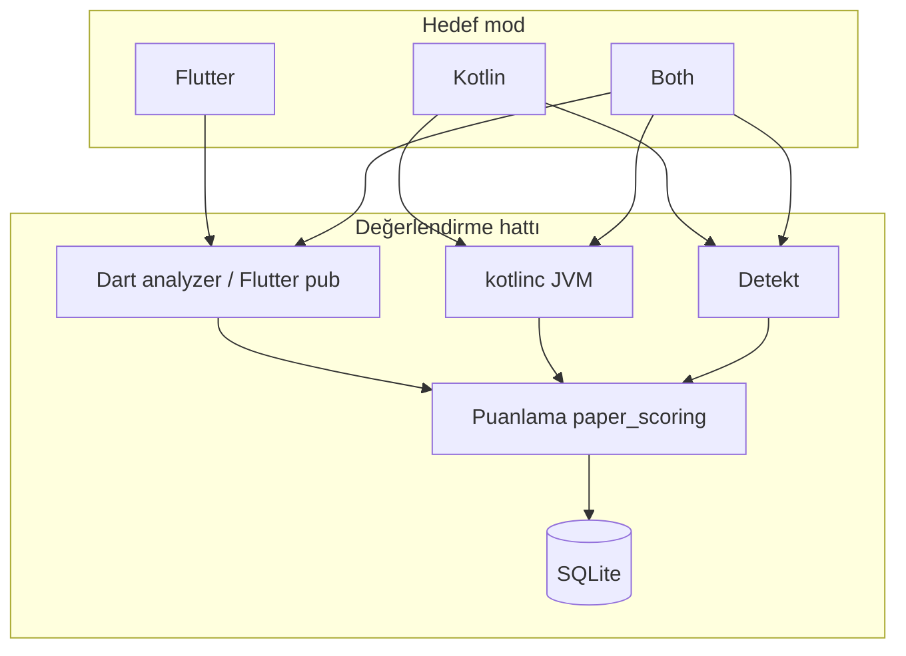
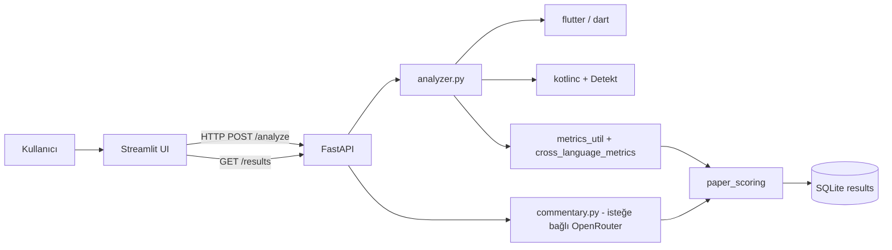
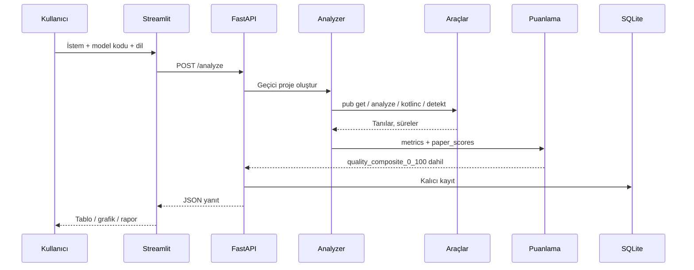

# Yöntem (Metodoloji)

**Amaç:** LLM üretimi Kotlin ve Flutter/Dart kodunun bu projede nasıl değerlendirildiğini, başka bir araştırmacının aynı prosedürü (ortam, araç sürümleri ve girdiler sabitken) tekrarlayabilmesi için net biçimde tanımlamak.

Bu çalışma **yeni bir derin öğrenme modeli eğitimi** içermez; **dış LLM çıktılarının** yerel araç zincirleriyle analiz edilmesi ve çok boyutlu puanlanması bir **değerlendirme hattı** olarak tanımlanır. Nicel kod metrikleri için ayrıntılı tanımlar **`metrics.md`** / **`metrics.tr.md`**; kullanıcı arayüzü ve kurulum için **`manual.md`** / **`manual.tr.md`** dosyalarına bakın.

---

## Grafiksel özet

Aşağıdaki şemalar sırasıyla **boyut × çeşitlilik** (hangi dil/modda hangi alt sistemlerin devreye girdiği), **sistem mimarisi** ve **tek bir analiz isteğinin akışı**nı özetler.

### Yapısal boyutlar ve çeşitler (mod × bileşen)

*Not:* Android çerçevesi içe aktaran Kotlin parçalarında **A2 (kotlinc)** atlanır; **A3 (Detekt)** çalışmaya devam eder.

### Çalışmanın mimari diyagramı

### Çalışma diyagramı (tek analiz döngüsü)

---

## 4.1 Çalışma tasarımı / mimari

**Genel tasarım:** Üç katmanlı bir yapı kullanılmıştır: (1) **sunum katmanı** — Streamlit tabanlı pano (`frontend/app.py`); (2) **uygulama / API katmanı** — FastAPI (`backend/main.py`); (3) **analiz ve kalıcılık** — geçici proje üreten analizör (`backend/analyzer.py`), metrik birleştirme (`backend/metrics_util.py`, `backend/cross_language_metrics.py`), puanlama (`backend/paper_scoring.py`) ve SQLite veritabanı (`backend/database.py`, varsayılan olarak `results/` altı).

**Bileşen tanımları (kısa):**

| Bileşen | İşlev |
|--------|--------|
| **Veri toplama (operasyonel)** | Aynı **istem** altında birden fazla LLM’den üretilmiş **kod metinleri** kullanıcı arayüzüne girilir veya snippet JSON ile yüklenir; kimlik için **`snippet_id`** kullanılır. |
| **Ön-işleme** | Kod, hedef dile göre geçici bir proje iskeletine yerleştirilir (Flutter için `pubspec` ve ilgili dosya yapısı; Kotlin için tek dosya veya küçük yapı). Android bağımlı Kotlin’de JVM derlemesi bilinçli olarak atlanır. |
| **Araç zinciri / “model” yokluğu** | Sistem, eğitilmiş bir sınıflandırıcı yerine **Dart analyzer**, **kotlinc**, **Detekt** ve isteğe bağlı **OpenRouter** üzerinden yapay zekâ destekli sadakat/yorum üretir. |
| **Değerlendirme modülü** | Statik tanılar, süreler, `metrics.md` ile uyumlu çapraz dil metrikleri, `paper_scores` (derlenebilirlik, statik sağlık, verimlilik, sadakat, birleşikler) ve karşılaştırma için **`quality_composite_0_100`**. |
| **Kalıcılık** | Her çalıştırma, aynı `snippet_id` + oturum mantığında güncellenerek SQLite’a yazılır; **History & winner** ve **Compare** aynı API’yi kullanır. |

**Karşılaştırma modları:** **Kotlin**, **Flutter** veya **Her ikisi (Both)**. **Both** seçildiğinde arayüzde altı kod kutusu (Flutter ve Kotlin satırları × üç model) bulunur; analiz yalnızca etkin dil satırları için tetiklenir. Grafiklerde **Both** modunda Flutter ve Kotlin serileri renkle ayrılır (Flutter mavi, Kotlin turuncu — `manual.md`).

---

## 4.2 Veri

**Veri kaynağı:** Çalışma **açık bir saha ölçümü veya sensör verisi** değildir. Birincil veri, araştırmacının veya katılımcının tanımladığı **görev istemi (prompt)** ve seçilen **büyük dil modellerinden** elde edilen **Kotlin** ve/veya **Flutter/Dart** **kaynak kodu metinleridir**. Coğrafi bölge veri seti düzeyinde raporlanmaz; üretim, kullanılan harici LLM hizmetlerinin politikalarına bağlıdır.

**Örnek sayısı:** Önceden sabitlenmiş bir “n örnek” sayısı yoktur; her analiz oturumunda kullanıcı kaç model/dil kombinasyonu gönderirse o kadar **çalıştırma (run)** kaydı oluşur. Tekrarlanabilirlik için **`snippet_id`**, dışa aktarılan **snippet JSON (sürüm 2)** ve araç sürümlerinin not edilmesi önerilir.

**Toplama yöntemi:** Metin tabanlı kopyalama-yapıştırma veya JSON içe aktarma; isteğe bağlı olarak OpenRouter üzerinden **otomatik sadakat puanı ve yorum** (`auto_commentary`).

**Etiketleme:** **Ground-truth kod doğruluğu etiketi yoktur.** **Sadakat (faithfulness)** isteğe bağlı olarak insan (manuel 1–5) veya yapay zekâ (0–100 ölçeğe map) ile **dereceli** hale getirilebilir; dereceli değilse `quality_composite` içinde sadakat ekseni **hariç tutulur** ve diğer ağırlıklar yeniden normalize edilir (`paper_scoring.py`).

**Veri kalitesi / tutarlılık:** Aynı `snippet_id` ile yapılan yeni analizler veritabanında **güncelleme** ile birleştirilir (çoğaltma yerine). Bu, tarihçe ve kazanan görünümlerinde tutarlı anahtar kullanımını kolaylaştırır.

**Ön-işleme:** Kod metni doğrudan tokenizer/regex tabanlı **cross_language_metrics** ile özet istatistiklere dönüştürülür; Flutter tarafında bağımlılık çözümü için **pub get** döngüleri çalıştırılabilir. **Normalizasyon / augmentasyon / imputation** klasik anlamda uygulanmaz; eksik metrikler için birleşik puanlarda **nötr 50** gibi sabitler kullanılır (MI ve iç içe geçme eksenleri).

---

## 4.3 Model / metod

**Algoritma türü:** Bu repo bir **CNN / XGBoost eğitimi** içermez. “Metod”, aşağıdaki **deterministik ve araç tabanlı** adımların birleşimidir.

1. **Statik analiz:** Kotlin için **Detekt** (XML/rapor çıktıları ayrıştırılır); Flutter/Dart için **dart analyze** (ve ilgili süreler).  
2. **Derleme denemesi:** JVM Kotlin için **kotlinc** (`setup.sh` / `setup.bat` ile `tools/kotlin/` veya `KOTLIN_HOME`). **JDK** zorunludur.  
3. **Metrik türetimi:** `metrics.md`’de tanımlanan cyclomatic complexity, LOC, yorum oranı, Halstead, MI, ortalama iç içe geçme derinliği; uygulamada Detekt/Dart çıktıları ile `cross_language_metrics` birlikte kullanılır.  
4. **Puanlama:**  
   - **Legacy birleşik:** `composite_default_0_100` — derlenebilirlik, statik analiz sağlığı, verimlilik, sadakat ağırlıkları `DEFAULT_WEIGHTS` (`paper_scoring.py`).  
   - **Karşılaştırma kazananı:** `quality_composite_0_100` — MI %30, iç içe geçme %10, analizör temizliği %30, sadakat %30 (sadakat yoksa kalan toplam ağırlık 0,70 olur; MI, iç içe geçme ve analizör sırasıyla **3/7, 1/7, 3/7** ≈ %42,86 / %14,29 / %42,86 oranında yeniden ölçeklenir).  
5. **İsteğe bağlı LLM çağrısı:** Sadakat ve açıklama metni için **OpenRouter** (model ortam değişkeni ile); bu adım API anahtarı yoksa devre dışıdır.

**Hiperparametreler:** Ceza katsayıları (ör. statik analizde 12 / 3,5 / 0,8 ve iç içe geçmede 15) **kod içi sabitlerdir**; veriyle kalibre edilmiş bir arama yoktur. İstenirse `paper_scoring.py` üzerinden değiştirilebilir.

**Çapraz-doğrulama / eğitim rutini:** Uygulanmaz (eğitilebilir model yok).

**Deney senaryoları (önerilen kullanım):** Aynı istem ve `snippet_id` altında modelleri yan yana çalıştırma; **Both** ile aynı görevde Flutter ve Kotlin üretimlerini karşılaştırma; AI sadakatini açık/kapalı **ablation** benzeri karşılaştırma; Android içe aktaran Kotlin örneklerinde **kotlinc atlanmış** koşulu açıkça raporlama.

---

## 4.4 Değerlendirme metodları

**Baarı / kalite metrikleri:**

- **İkili ve süreler:** `compilable`, toplam ve aşama süreleri (ms).  
- **Statik tanı sayıları:** Hata, uyarı, bilgi (Flutter iskelet notları ayrı sayılabilir).  
- **`metrics.md` metrikleri:** Cyclomatic complexity, LOC, yorum oranı, Halstead volume/difficulty, MI, ortalama iç içe geçme derinliği.  
- **Birleşik skorlar:** `composite_default_0_100`, **`quality_composite_0_100`** (Compare/History kazananı).  
- **Sadakat:** 0–100 veya 1–5 ölçek (kaynak: manuel veya AI).

**İstatistiksel testler:** Bu yazılım paketi **t-test, ANOVA veya güven aralığı** üretmez. Model A vs B iddiası için dışarıda tekrar sayısı ve uygun test seçimi araştırmacı sorumluluğundadır.

**Deney tekrarı ve rastgelelik:** Analiz hattı, aynı kod ve aynı araç sürümlerinde **deterministik** kabul edilir. Harici LLM’lerin **sıcaklık** ve **örneklem** politikaları bu repoda sabitlenmez; tekrarlanabilirlik için istem, model adı, sıcaklık ve tarih not edilmelidir. Repoda analiz için **sabit rastgelelik tohumu** kullanımı yoktur.

**Sınırlamalar (raporlamada belirtilmeli):** (1) Sezgisel ağırlıklar ve cezalar etiketli veriyle öğrenilmemiştir. (2) Android SDK olmadan Kotlin derlemesi tam doğrulama sağlamaz. (3) `quality_composite` pratik bir özet skordur; istatistiksel üstünlük kanıtı değildir.

---

## Tekrarlanabilirlik kontrol listesi

1. İşletim sistemi, Python sürümü, Flutter/Dart ve JDK sürümlerini kaydedin.  
2. `setup.sh` veya `setup.bat` ile kurulan **Kotlin** yolunu ve **detekt-cli.jar** sürümünü not edin.  
3. Kullanılan **snippet JSON (v2)** veya eşdeğer ham girdileri saklayın.  
4. Harici LLM için model adı, istem ve mümkünse API parametrelerini (ör. sıcaklık) belgeleyin.  
5. Sonuçları SQLite yedekten veya dışa aktarılan raporlardan doğrulayın.

Bu dosya, kullanıcı kılavuzları ve metrik tanımlarıyla birlikte okunduğunda çalışmanın **yöntem** bölümünü tek başına destekleyecek düzeyde ayrıntı içerir.
